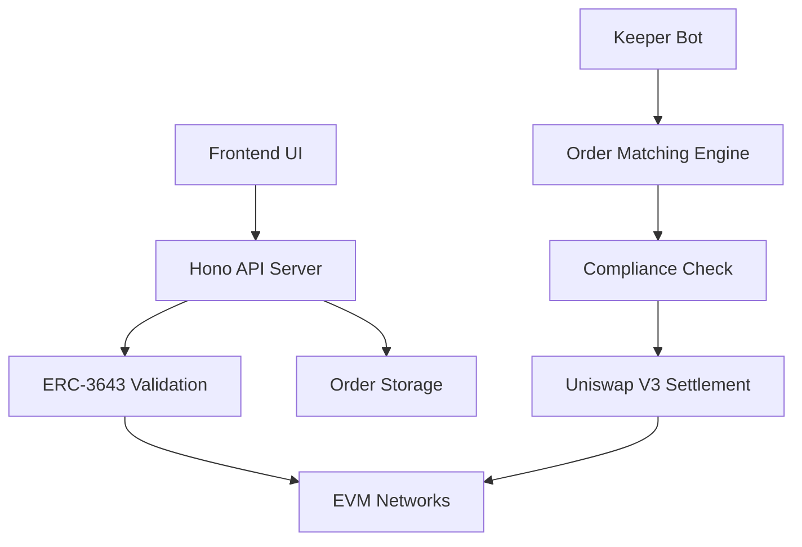

# EVM Orderbook - ERC-3643 Compliant Decentralized Exchange

[](https://opensource.org/licenses/MIT)
[](https://www.typescriptlang.org/)
[](https://bun.sh/)
[](https://erc3643.org/)

A **production-ready ERC-3643 compliant decentralized orderbook** built with **Hono framework** and **Viem**, featuring **Uniswap V3 automated settlement**, **real-time compliance validation**, and **enterprise-grade security** for tokenized securities trading.

---

## 🏗️ **System Architecture**

### **Core Components**



- **🔐 ERC-3643 Compliance Layer**: Identity verification, transfer validation, and accreditation checks
- **📊 Price-Time Priority Matching**: Sophisticated order matching algorithm with real-time execution
- **⚡ Uniswap V3 Settlement**: Automated market settlement through concentrated liquidity pools
- **🤖 Keeper Automation**: Continuous order monitoring and settlement execution
- **🌐 Multi-Chain Support**: Anvil, Sepolia, Base Sepolia, Optimism Sepolia networks

---

## 🚀 **Quick Start**

### **Prerequisites**

- **Bun** >= 1.0.0 ([Installation Guide](https://bun.sh/docs/installation))
- **Node.js** >= 18.0.0

### **Installation**

```bash
# Clone and navigate to the orderbook directory
cd backend/orderbook

# Install dependencies
bun install

# Copy environment configuration
cp .env.example .env

# Start local EVM network (in another terminal)
anvil --chain-id 31337

# Start the orderbook server
bun run dev

# Start the keeper bot (in another terminal)
bun run keeper:dev
```

### **Environment Setup**

Edit `.env` with your configuration:

```bash
# Basic configuration for local development
VITE_EVM_RPC_URL=http://127.0.0.1:8545
CHAIN_ID=31337
KEEPER_PRIVATE_KEY=0xac0974bec39a17e36ba4a6b4d238ff944bacb478cbed5efcae784d7bf4f2ff80
ORDERBOOK_API_URL=http://localhost:3001
```

---

## 📋 **API Documentation**

### **Base URL**: `http://localhost:3001`

### **Order Management**

#### **POST /api/orders**
Create a new limit order with ERC-3643 compliance validation.

**Request Body:**
```json
{
  "maker": "0x1234567890123456789012345678901234567890",
  "tokenIn": "0xA0b86a33E6441e88C5F2712B4Eb2b9c7C0dC4d79",
  "tokenOut": "0xC02aaA39b223FE8D0A0e5C4F27eAD9083C756Cc2",
  "amountIn": "1000000000000000000",
  "amountOut": "500000000000000000",
  "price": "0.5",
  "orderType": "limit",
  "expiry": 1703123456,
  "identityRegistry": "0xabcdef1234567890abcdef1234567890abcdef12",
  "compliance": "0x1234567890123456789012345678901234567890",
  "poolAddress": "0x1234567890123456789012345678901234567890",
  "signature": "0x..."
}
```

**Response:**
```json
{
  "orderId": "uuid-123",
  "status": "Order created successfully",
  "order": {
    "id": "uuid-123",
    "maker": "0x1234...",
    "status": "pending"
  }
}
```

#### **GET /api/orders**
Retrieve orders with optional filtering.

**Query Parameters:**
- `status` - Order status (pending, filled, cancelled, expired)
- `maker` - Maker address
- `tokenIn` - Input token address
- `tokenOut` - Output token address

**Example:**
```bash
GET /api/orders?status=pending&tokenIn=0xA0b86a33E6441e88C5F2712B4Eb2b9c7C0dC4d79
```

#### **DELETE /api/orders/:id**
Cancel an order (maker only).

### **Health Monitoring**

#### **GET /health**
System health check with blockchain connectivity.

**Response:**
```json
{
  "status": "healthy",
  "timestamp": "2024-01-01T00:00:00.000Z",
  "blockchain": {
    "connected": true,
    "blockNumber": "12345678",
    "chainId": 31337
  },
  "orderbook": {
    "totalOrders": 150,
    "pendingOrders": 42,
    "totalMatches": 23
  }
}
```

---

## 🔧 **Configuration**

### **Supported Networks**

| Network | Chain ID | RPC URL |
|---------|----------|---------|
| **Anvil** (Local) | 31337 | `http://127.0.0.1:8545` |
| **Sepolia** | 11155111 | `https://sepolia.infura.io/v3/YOUR_KEY` |
| **Base Sepolia** | 84532 | `https://sepolia.base.org` |
| **Optimism Sepolia** | 11155420 | `https://sepolia.optimism.io` |

### **Environment Variables**

#### **Required**
- `VITE_EVM_RPC_URL` - Blockchain RPC endpoint
- `CHAIN_ID` - Target network chain ID
- `KEEPER_PRIVATE_KEY` - Private key for order execution

#### **Optional**
- `PORT=3001` - Server port
- `MATCHING_INTERVAL=30000` - Order matching frequency (ms)
- `MAX_MATCHES_PER_RUN=10` - Max matches per execution cycle
- `MIN_ORDER_SIZE=1000000000000000000` - Minimum order size (wei)

---

## 🧪 **Testing**

### **Unit Tests**
```bash
# Run all tests
bun test

# Run with coverage
bun test --coverage

# Watch mode for development
bun test --watch
```

### **Integration Tests**
```bash
# Test against local Anvil network
bun test integration/
```

### **Test Coverage**
- ✅ ERC-3643 compliance validation
- ✅ Uniswap V3 pool validation
- ✅ Order matching algorithms
- ✅ Compliance transfer notifications
- ✅ Error handling and edge cases

---

## 🏭 **ERC-3643 Compliance Features**

### **Identity Verification**
- **ONCHAINID Integration**: ERC-734/735 identity management
- **Claim Validation**: KYC, accreditation, and qualification checks
- **Multi-Registry Support**: Network-specific identity registries

### **Transfer Compliance**
- **Pre-Transfer Validation**: `canTransfer()` checks before execution
- **Post-Transfer Notification**: `transferred()` calls after settlement
- **Modular Compliance**: Pluggable compliance modules

### **Regulatory Features**
- **Jurisdiction Restrictions**: Country-based transfer controls
- **Accreditation Requirements**: Qualified investor validation
- **Audit Trail**: Complete transaction history with compliance events

---

## ⚡ **Uniswap V3 Integration**

### **Automated Settlement**
- **Pool Validation**: Token pair and fee tier verification
- **Optimal Routing**: Price impact minimization
- **Slippage Protection**: Configurable tolerance settings

### **Order Types Supported**
- **Limit Orders**: Price-specific order execution
- **Market Orders**: Immediate execution at best available price
- **Partial Fills**: Support for large order fragmentation

### **Settlement Flow**
1. **Order Matching**: Price-time priority algorithm
2. **Compliance Check**: ERC-3643 transfer validation
3. **Swap Execution**: Uniswap V3 pool interaction
4. **Notification**: Compliance module updates

---

## 🤖 **Keeper Automation**

### **Order Matching Engine**
- **Price-Time Priority**: Best price first, then earliest timestamp
- **Real-Time Execution**: Continuous monitoring and settlement
- **Batch Processing**: Efficient multi-order execution

### **Keeper Configuration**
```typescript
const keeperConfig = {
  matchingInterval: 30000,     // 30 seconds
  maxMatchesPerRun: 10,        // Batch size limit
  minOrderSize: '1e18',        // Minimum order value
  slippageTolerance: 0.05      // 5% price protection
};
```

### **Monitoring & Logging**
- **Execution Metrics**: Match success/failure rates
- **Gas Usage Tracking**: Transaction cost monitoring
- **Error Recovery**: Automatic retry mechanisms

---

## 🛡️ **Security Considerations**

### **Private Key Management**
- **Never commit private keys** to version control
- **Use environment variables** for sensitive configuration
- **Implement key rotation** for production deployments

### **Compliance Validation**
- **Multi-layer checks**: Identity, transfer, and accreditation validation
- **Fail-safe defaults**: Deny transfers when compliance checks fail
- **Audit logging**: Complete transaction history for regulatory compliance

### **Network Security**
- **RPC endpoint validation**: Verify blockchain connectivity
- **Transaction simulation**: Gas estimation and execution preview
- **Error boundaries**: Graceful failure handling

---

## 📊 **Monitoring & Observability**

### **Health Endpoints**
- **GET /health**: System status and blockchain connectivity
- **Detailed metrics**: Block numbers, order counts, match statistics

### **Logging**
- **Structured logging** with Pino
- **Configurable log levels**: debug, info, warn, error
- **Request tracing**: Correlation IDs for debugging

### **Metrics**
- **Order throughput**: Orders processed per minute
- **Matching efficiency**: Success rate of order matches
- **Gas consumption**: Average transaction costs

---

## 🔄 **Development Workflow**

### **Local Development**
```bash
# Start local EVM network
anvil --chain-id 31337

# Install dependencies
bun install

# Start development servers
bun run dev          # API Server
bun run keeper:dev   # Keeper Bot

# Run tests
bun test
```

### **Production Deployment**
```bash
# Build for production
bun run build

# Start production server
bun run start

# Start keeper in background
bun run keeper
```

### **Code Quality**
```bash
# Type checking
bun run typecheck

# Linting
bun run lint

# Formatting
bun run format
```

---

## 🤝 **Contributing**

### **Development Setup**
1. Fork the repository
2. Create a feature branch
3. Implement changes with tests
4. Ensure all tests pass
5. Submit a pull request

### **Code Standards**
- **TypeScript strict mode** enabled
- **TDD approach**: Tests before implementation
- **Comprehensive documentation** for all functions
- **Security-first mindset** for all blockchain interactions

### **Testing Requirements**
- **Unit test coverage** > 90%
- **Integration tests** for all critical paths
- **Security testing** for compliance functions
- **Gas usage testing** for keeper operations

---

## 📄 **License**

**MIT License** - see [LICENSE](LICENSE) file for details.

---

## 🆘 **Support**

### **Documentation**
- [ERC-3643 Specification](https://erc3643.org/)
- [Uniswap V3 Documentation](https://docs.uniswap.org/)
- [Viem Documentation](https://viem.sh/)
- [Hono Framework](https://hono.dev/)

### **Community**
- **Issues**: [GitHub Issues](https://github.com/farsquare/evm-orderbook/issues)
- **Discussions**: [GitHub Discussions](https://github.com/farsquare/evm-orderbook/discussions)

### **Security**
For security vulnerabilities, please email security@farsquare.com

---

**Built with ❤️ by Farsquare - Revolutionizing tokenized securities trading**
